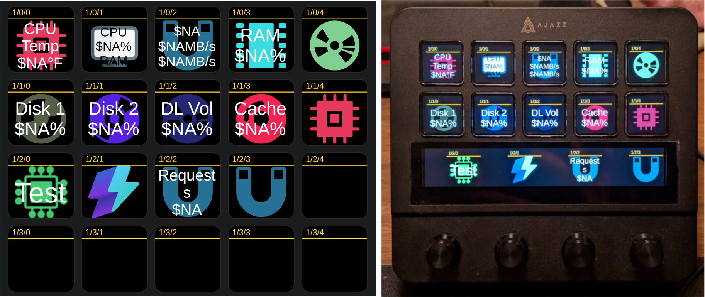

# Ajazz / Mirabox Companion Bridge

This application connects Ajazz and Mirabox LCD macro pads to [Bitfocus Companion](https://bitfocus.io/companion), allowing them to function as native control surfaces (similar to an Elgato Stream Deck).

It runs quietly in your Windows System Tray and translates the USB signals from your device into network commands that Companion understands, bypassing rigid hardware limitations to unlock features like ultra-wide touch screen compositing and rotary dial support.

---



---

## Supported Devices

In theory, this bridge automatically detects and configures itself for the following hardware:

  * **Ajazz AKP05** (5x4 grid) — *Only tested on this device. Includes support for the Touch Strip, Rotary Dials, and Screen Swipes*
  * **Ajazz AKP05E Pro** (5x5 grid)
  * **Ajazz AKP153** (5x3 grid)
  * **Ajazz AKP153E** (5x3 grid)
  * **Ajazz AKP153R** (5x3 grid)
  * **Mirabox N4** (5x3 grid)
  * **Mirabox N4E** (5x3 grid)

-----

## Part 1: Prerequisites

Before starting, ensure you have the following installed on your Windows machine:

1.  **Node.js**: Download and install the LTS (Long Term Support) version from [nodejs.org](https://nodejs.org/).
2.  **Bitfocus Companion**: Version 3.0 or higher is required.

-----

## Part 2: Bitfocus Companion Setup

Companion must be told to listen for our bridge.

1.  Open the Bitfocus Companion web interface (usually `http://127.0.0.1:8000`).
2.  Navigate to the **Settings** tab at the top.
3.  Click on the **Satellite API** sub-tab.
4.  Set **Enable Satellite API** to ON.
5.  Ensure the **Port** is set to `16622`.
6.  Click **Save**.

**CRITICAL STEP**: If you are using Companion 3.0 or newer, you must disable the native drivers, or Windows will block this bridge from accessing the hardware.

1.  Navigate to **Settings** \> **Surfaces**.
2.  Find **"Enable connected Mirabox Stream Dock devices"** and toggle it **OFF**.
3.  (Optional) You may also turn off "Enable connected Elgato Stream Deck devices" if you do not own a physical Stream Deck.

-----

## Part 3: Installing the Bridge

1.  Download or clone this project folder (`ajazz-bridge`) to your computer.
2.  Open **PowerShell** or **Command Prompt**.
3.  Navigate to the folder where you saved the project. For example:
    `cd C:\Users\YourName\Documents\ajazz-bridge`
4.  Install the required background libraries by typing the following command and pressing Enter:
    `npm install`

-----

## Part 4: Configuration (.env file)

The bridge uses a hidden configuration file named `.env` to know how to talk to Companion and how fast to draw images on your screen.

If you followed the standard installation, your `.env` file looks like this:

```text
COMPANION_HOST=127.0.0.1
COMPANION_PORT=16622
HID_WRITE_DELAY_MS=0
```

### When and How to Change the IP Address (`COMPANION_HOST`)

  * **Default (`127.0.0.1`)**: This means "this exact computer." If your Ajazz pad is plugged into the *same* computer that is running Bitfocus Companion, leave this exactly as is.
  * **When to Change**: Change this if your Ajazz pad is plugged into your gaming PC, but Bitfocus Companion is running on a different machine (like a dedicated Streaming PC, a Mac, or an Unraid server).
  * **How to Change**:
    1.  Find the IP address of your Streaming PC/Server (e.g., `192.168.1.50`).
    2.  Open the `.env` file in Notepad.
    3.  Change `COMPANION_HOST=127.0.0.1` to `COMPANION_HOST=192.168.1.50`.

### When and How to Change the Write Delay (`HID_WRITE_DELAY_MS`)

  * **Default (`0`)**: This commands the bridge to send image data to the LCD screen as fast as your computer's USB controller allows (Zero artificial delay).
  * **When to Change**: USB controllers vary by motherboard. If you change pages in Companion and the buttons on your Ajazz pad look "glitchy", "torn", or only draw halfway, your USB controller is being overwhelmed.
  * **How to Change**: To fix screen tearing, open the `.env` file and increase the delay to slow down the data transfer. Change `HID_WRITE_DELAY_MS=0` to `HID_WRITE_DELAY_MS=1`. If it still tears, increase it to `2` or `5`.

-----

## Part 5: Ajazz AKP05 Mapping Guide

Because the AKP05 has LCD buttons, an ultra-wide touch strip, and physical rotary dials, Companion maps it into a perfectly packed **5-column by 4-row** grid (20 total keys).

Use this cheat sheet to know which Companion button controls which physical feature on your device:

| Physical Feature | Companion Row | Companion Buttons (Row/Col) |
| :--- | :--- | :--- |
| **Top Row (Main)** | Row 0 | `0/0`, `0/1`, `0/2`, `0/3`, `0/4` |
| **Middle Row (Main)** | Row 1 | `1/0`, `1/1`, `1/2`, `1/3`, `1/4` |
| **Touch Strip (LCD)** | Row 2 | `2/0`, `2/1`, `2/2`, `2/3` |
| **Touch Strip Swipe Left** | Row 2 | `2/4` *(Acts as a standard button press)* |
| **Rotary Dial 1 (Far Left)** | Row 3 | `3/0` *(Push, Rotate L/R)* |
| **Rotary Dial 2** | Row 3 | `3/1` *(Push, Rotate L/R)* |
| **Rotary Dial 3** | Row 3 | `3/2` *(Push, Rotate L/R)* |
| **Rotary Dial 4 (Far Right)** | Row 3 | `3/3` *(Push, Rotate L/R)* |
| **Touch Strip Swipe Right** | Row 3 | `3/4` *(Acts as a standard button press)* |

*Note: Companion allows you to assign specific Rotary Actions to dials. Simply click the button (e.g., `3/0`) in the Companion UI and navigate to the "Rotary Actions" tab to set up Left and Right turn behaviors.*

-----

## Part 6: Running the Bridge

To start the bridge manually:

1.  Open PowerShell in your `ajazz-bridge` folder.
2.  Type `node index.js` and press Enter.

A star icon will appear in your Windows System Tray (the area next to your clock). Your Ajazz/Mirabox screen will wake up, and Companion will now show the device under the **Surfaces** tab.

To close the bridge, simply right-click the tray icon and select **Quit**.

-----

## Part 7: Windows Auto-Start (Headless Mode)

To make the bridge run automatically in the background every time you turn on your PC:

1.  Locate the `launch-bridge.vbs` file inside the `ajazz-bridge` folder. (If it doesn't exist, create a text file named `launch-bridge.vbs` and paste the code block below into it).

<!-- end list -->

```vbscript
Set WshShell = CreateObject("WScript.Shell")
WshShell.CurrentDirectory = CreateObject("Scripting.FileSystemObject").GetParentFolderName(WScript.ScriptFullName)
WshShell.Run "cmd /c node index.js", 0, False
```

2.  Right-click `launch-bridge.vbs` and select **Copy**.
3.  Press the `Windows Key + R` on your keyboard to open the Run dialog.
4.  Type `shell:startup` and press Enter. This opens your Windows Startup folder.
5.  Right-click inside the Startup folder and select **Paste shortcut**.

Now, whenever you log into Windows, the bridge will silently start and connect your macro pad to Companion.

-----

## Acknowledgments

This project builds upon the foundational reverse engineering and protocol discovery of these devices shared by the open-source community. Special thanks to:

  * [ambiso/opendeck-akp05](https://github.com/ambiso/opendeck-akp05)
  * [4ndv/mirajazz](https://github.com/4ndv/mirajazz)

-----

## Troubleshooting

  * **The device isn't lighting up:** Ensure the original manufacturer software (e.g., the official Ajazz desktop app) is completely closed. Only one application can control the USB device at a time.
  * **Logs:** Check the `bridge.log` file in the project folder. It records all connection attempts and errors.
  * **Companion shows an error:** Double-check that your `.env` file points to the correct IP address and that the Companion Satellite API port is strictly set to the matching port.